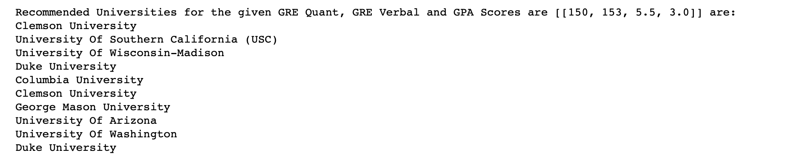
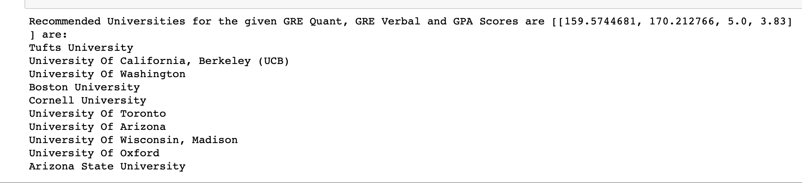
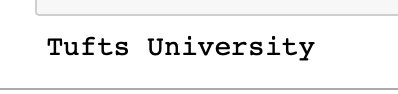

# Graduate-School-Recommender-System
As competition for admission into higher education increases, it becomes even more important for applicants to find graduate schools that fit their requirements and expectation. Selecting appropriate schools to apply, however, is a time-consuming process, especially when looking for schools at graduate level due to the various factors in decision making imposed by the schools and applicants. This problem can be addressed by developing a recommender system for graduate admission seekers which can help them to choose graduate school matching their academic profile. 

Data is scraped from edulix.com. The required data is extracted from the HTML by using the python library ‘BeautifulSoup’.

Data Pre-processing Steps:
1. GRE Quant and Verbal scores are cleansed since they contained the scores of both old and new versions of the examination. The old scores are converted to new scores.

2. All the GPA scores were uniformly scaled to 4 point scale. 

3.The empty fields are replaced with the average value.  

Implemented 2 models.
1. K Nearest Neighbors
2. CNN

KNN recommends n universities whereas CNN recommends only 1 university.

Sample Output of KNN:

Sample Output of CNN for the scores [159.5744681, 170.212766, 5.0, 3.83] is:

